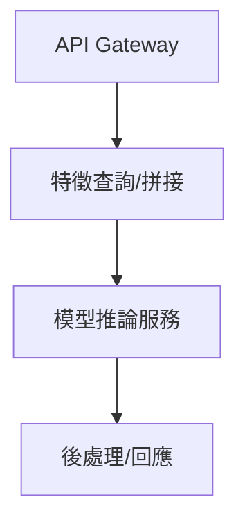

# 線上-離線分離設計：離線訓練、線上推論、特徵更新與 Lambda/Kappa 架構

現代 AI 系統需兼顧離線大規模訓練與線上低延遲推論。從離線訓練到線上推論 call graph、近線/Streaming 特徵更新，再到 Lambda/Kappa 架構比較，本章將結合理論、圖解、實戰、面試熱點與常見誤區，幫助你設計高效穩健的 AI 服務。

---

## 離線訓練 → 線上推論 call graph

### 離線訓練

- 利用全量歷史資料，批次訓練模型
- 支援特徵工程、超參數搜尋、模型選擇
- 訓練週期：小時/天級，資源彈性調度

### 線上推論

- 實時接收請求，低延遲回傳預測結果
- 需優化模型大小、推論速度、資源佔用
- 推論 call graph：API Gateway → 特徵查詢 → 預測服務 → 後處理 → 回應

---

## 近線 vs. Streaming 特徵更新

### 近線特徵（Nearline Feature）

- 以分鐘/小時為單位批次更新
- 適合不需即時的統計特徵（如 1 小時內點擊數）

### Streaming 特徵

- 事件到達即時更新，毫秒/秒級延遲
- 適合即時推薦、風控、監控

### 特徵更新設計

- 需考慮資料延遲、特徵一致性、線上/離線同步
- 常用工具：Kafka、Flink、Redis、Feature Store

---

## Lambda/Kappa 架構比較

### Lambda 架構

- 同時維護 Batch（離線）與 Streaming（即時）兩條管線
- 優點：彈性高，兼顧準確與即時
- 缺點：維運複雜，需合併結果

### Kappa 架構

- 全部以 Streaming 處理，離線/即時統一邏輯
- 優點：架構簡單，易於維護
- 缺點：對歷史重算、複雜聚合有挑戰

| 架構   | 優點      | 缺點       | 適用場景             |
| ------ | --------- | ---------- | -------------------- |
| Lambda | 準確+即時 | 維運複雜   | 金融、推薦、IoT      |
| Kappa  | 架構簡單  | 歷史重算難 | 日誌、監控、簡單聚合 |

---

## 理論直覺、應用場景與常見誤區

### 應用場景

- 推薦系統、廣告排序、金融風控、即時監控、IoT 平台

### 常見誤區

- 離線/線上特徵未同步，導致 Training-Serving Skew
- Lambda 架構維運成本高，結果合併複雜
- Streaming 特徵未考慮延遲與一致性，推論不準

---

## 面試熱點與經典問題

| 主題                  | 常見問題                 |
| --------------------- | ------------------------ |
| 線上-離線分離         | 為何要分離？             |
| 推論 call graph       | 如何設計？               |
| 特徵更新              | 近線 vs Streaming 差異？ |
| Lambda/Kappa          | 架構比較與選型？         |
| Training-Serving Skew | 如何解決？               |

---

## 使用注意事項

* 離線/線上特徵需嚴格同步與驗證
* Streaming 特徵建議用 Feature Store 管理
* Lambda/Kappa 架構選型需根據業務需求與團隊能力

---

## 延伸閱讀與資源

* [Lambda Architecture 解釋](https://martinfowler.com/bliki/LambdaArchitecture.html)
* [Kappa Architecture 解釋](https://www.oreilly.com/radar/questioning-the-lambda-architecture/)
* [Feature Store 實踐](https://docs.feast.dev/)
* [Training-Serving Skew 解法](https://cloud.google.com/architecture/mlops-continuous-delivery-and-automation-pipelines-in-machine-learning#feature_store)

---

## 經典面試題與解法提示

1. 線上-離線分離的必要性？
2. 推論 call graph 設計細節？
3. 近線/Streaming 特徵更新的優缺點？
4. Lambda/Kappa 架構選型原則？
5. Training-Serving Skew 如何解決？
6. 如何用 Python 實作線上特徵查詢？
7. Streaming 特徵一致性驗證？
8. 離線/線上特徵同步策略？
9. Lambda 架構下結果合併挑戰？
10. Kappa 架構適用限制？

---

## 結語

線上-離線分離設計是 AI 系統穩健運營的關鍵。熟悉離線訓練、線上推論、特徵更新與 Lambda/Kappa 架構，能讓你打造高效可靠的智能服務。下一章將進入 Feature Pipeline 實戰，敬請期待！
