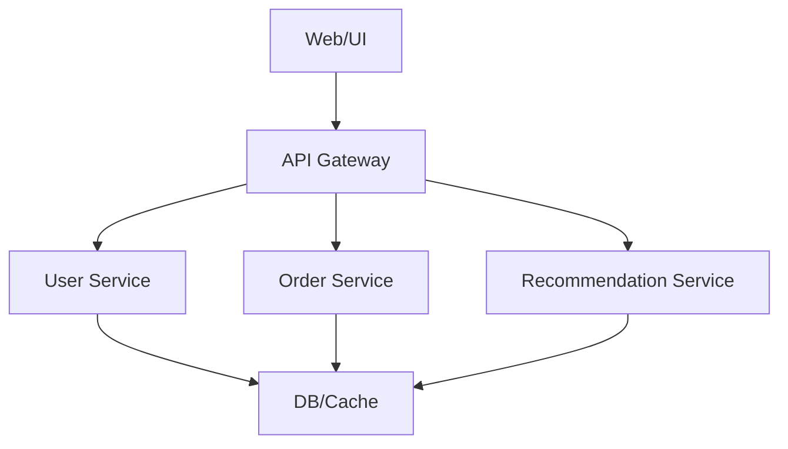

# 系統設計思維起手式：擴充、CAP/PACELC、SLA/SLO/SLI、三層到微服務

大型系統設計是軟體工程師與 MLOps 必備能力。從垂直/水平擴充、CAP/PACELC 理論，到 SLA/SLO/SLI 擬定，再到三層架構與微服務拆分直覺，本章將結合理論、圖解、實戰、面試熱點與常見誤區，幫助你建立系統設計全局觀。

---

## 垂直 vs. 水平擴充

### 垂直擴充（Scale Up）

- 增加單台機器 CPU、記憶體、磁碟等資源
- 優點：架構簡單、維運容易
- 缺點：硬體上限、單點故障風險

### 水平擴充（Scale Out）

- 增加多台機器分攤負載，支援自動擴容
- 優點：高可用、彈性擴展、容錯佳
- 缺點：需解決資料一致性、分布式協調

---

## CAP & PACELC 理論

### CAP 理論

- 一致性（Consistency）、可用性（Availability）、分區容忍性（Partition Tolerance）
- 分布式系統最多同時滿足兩者，需根據業務選擇

### PACELC 理論

- Partition 發生時選 CA/CP，Else 時選 Latency/Consistency
- 更貼近現代分布式系統設計（如 DynamoDB、Cassandra）

---

## SLA / SLO / SLI 擬定流程

- SLA（Service Level Agreement）：對外承諾（如 99.9% 可用性）
- SLO（Service Level Objective）：內部目標（如 99.95% 延遲 < 100ms）
- SLI（Service Level Indicator）：實際指標（如平均延遲、錯誤率）

### 擬定流程

1. 明確定義業務需求與用戶期望
2. 設計可量測的 SLI
3. 擬定合理 SLO，並與業務協商
4. 對外公告 SLA，定期審查與調整

---

## 典型三層架構 → 微服務拆分直覺

### 三層架構（Three-Tier Architecture）

- 表現層（Web/UI）、邏輯層（API/Service）、資料層（DB/Cache）
- 優點：分工明確、易於維護

### 微服務架構（Microservices）

- 將單體應用拆分為多個小服務，獨立部署、擴展
- 優點：彈性擴容、技術異構、故障隔離
- 拆分直覺：依據業務邊界、資料一致性需求、流量瓶頸

---

## 理論直覺、應用場景與常見誤區

### 應用場景

- 高流量網站、推薦系統、金融交易、雲端平台、AI 服務

### 常見誤區

- 盲目微服務拆分，導致維運複雜
- SLA/SLO/SLI 未明確定義，難以監控與優化
- 垂直擴充過度依賴單點，缺乏容錯

---

## 面試熱點與經典問題

| 主題        | 常見問題             |
| ----------- | -------------------- |
| CAP/PACELC  | 理論推導與實務選型？ |
| 擴充策略    | 何時選垂直/水平？    |
| SLA/SLO/SLI | 差異與擬定流程？     |
| 微服務拆分  | 拆分依據與風險？     |
| 三層架構    | 優缺點與演進？       |

---

## 使用注意事項

* 擴充策略需根據預算、業務成長與技術棧選擇
* SLA/SLO/SLI 需定期審查與調整
* 微服務拆分建議先從流量/業務瓶頸切入

---

## 延伸閱讀與資源

* [Google SRE Book: SLI/SLO/SLA](https://sre.google/sre-book/service-level-objectives/)
* [CAP 理論解釋](https://www.infoq.com/articles/cap-twelve-years-later-how-the-rules-have-changed/)
* [微服務設計模式](https://microservices.io/patterns/index.html)
* [PACELC 論文](https://dl.acm.org/doi/10.1145/1929957.1929961)

---

## 經典面試題與解法提示

1. CAP/PACELC 理論推導與應用場景？
2. 垂直/水平擴充選型與風險？
3. SLA/SLO/SLI 擬定與監控？
4. 微服務拆分依據與常見失敗案例？
5. 三層架構如何演進到微服務？
6. 如何用圖解說明系統設計思路？
7. SLA/SLO/SLI 實作細節？
8. 微服務拆分後資料一致性如何處理？
9. 擴充策略如何兼顧成本與彈性？
10. 系統設計常見瓶頸與優化？

---

## 結語

系統設計思維是大型平台與 MLOps 的基石。熟悉擴充、CAP/PACELC、SLA/SLO/SLI 與三層/微服務架構，能讓你在設計與面試中展現專業素養。下一章將進入流量洪峰與高可用策略，敬請期待！
